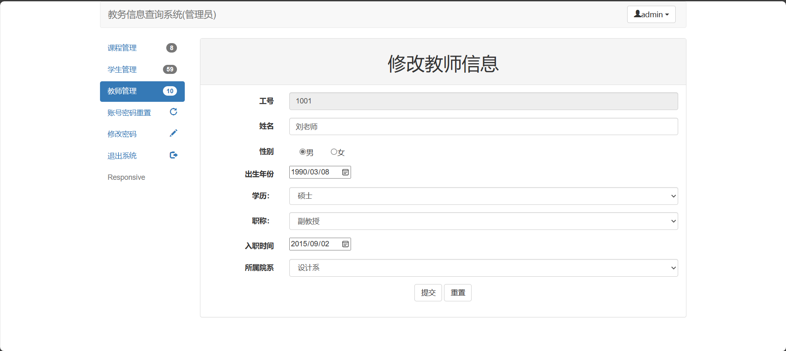
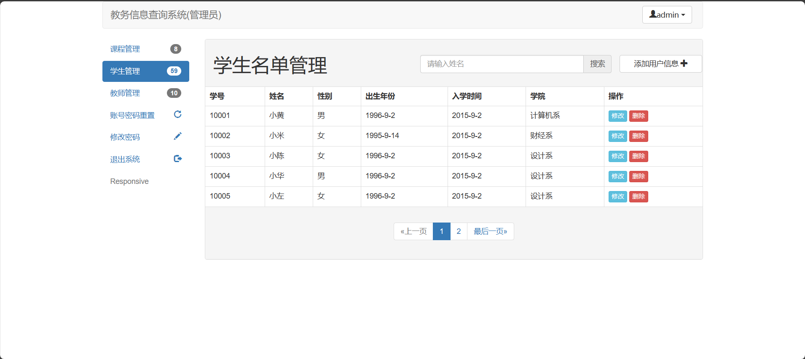
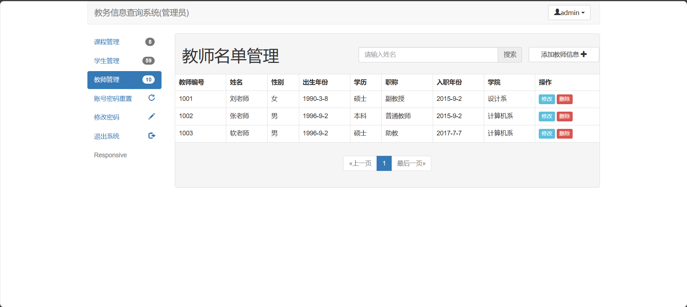
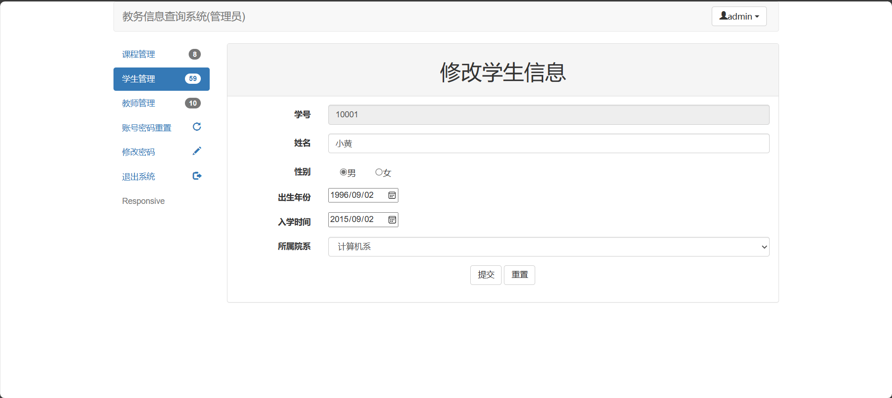
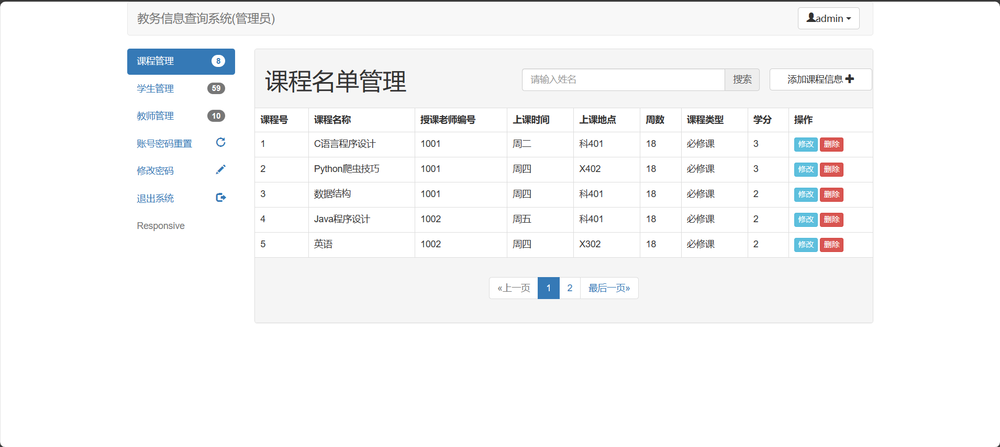

<h1 align="center">基于SSM框架的教务管理系统</h1>

 获取sql文件 QQ: 386869957 QQ群: 377586148 

 [个人站点: 从戎源码网](https://armycodes.com/)

## 简介

> 本代码来源于网络,仅供学习参考使用!
>
> 提供1.远程部署/2.修改代码/3.设计文档指导/4.框架代码讲解等服务
>
> 前端首页: http://localhost:8081/login.jsp
>
> 管理员登录地址：http://localhost:8081/login.jsp
>
> 管理员: admin 密码: 123
> 
> 老师登录地址：http://localhost:8081/login.jsp
>
> 老师: 1001 密码: 123
>
> 学生登录地址：http://localhost:8081/login.jsp
>
> 学生：10001 密码: 123

## 项目介绍

基于SSM框架的教务管理系统：前端 JSP、BootStrap、JQuery、Ajax，后端 SpringMVC、Mybatis，系统角色分为：老师、学生和管理员，管理员在管理后台录入课程、教师信息，教师根据自己的授课情况给学生打分，学生根据教务处安排的课程进行选课；主要功能如下：

### 管理员：

- 基本操作：登录、修改密码、修改密码、重置其他账号密码
- 课程管理：筛选课程、添加课程信息、修改课程信息、删除课程、获取课程列表、查看课程详情
- 学生管理：筛选学生、添加学生信息、获取学生信息列表、查看学生信息详情、删除学生、修改学生信息
- 教师管理：筛选教师、添加教师信息、获取教师信息列表、查看教师信息详情、删除教师、修改教师信息

### 教师：

- 基本操作：登录、修改密码、获取个人信息、修改个人信息
- 我的课程：筛选课程、获取授课列表、查看该课学生列表、给该课下的学生打分、获取课程基本信息

### 学生：

- 基本操作：登录、修改密码、获取个人信息、修改个人信息
- 所有课程：获取课程列表、选课、筛选课程、获取课程详情 
- 已选课程：获取已选课程列表、获取课程信息、退课
- 已修课程：获取已修课程列表、获取课程信息、获取课程成绩

## 环境

- <b>IntelliJ IDEA 2020.3</b>

- <b>Mysql 5.7.26</b>

- <b>Tomcat 8.0.32</b>

- <b>Maven 3.6.3</b>

- <b>JDK 1.8</b>

## 运行截图

